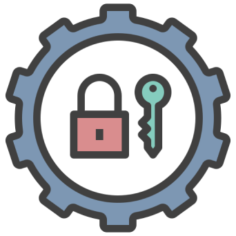

# 
SafeK8s

  

## Descrição

O **SafeK8s** é um aplicativo móvel desenvolvido para gerenciar e armazenar senhas de forma segura e prática. Com uma interface intuitiva, o SafeK8s garante que os usuários possam acessar suas credenciais de maneira rápida e fácil, sem comprometer a segurança dos seus dados. O aplicativo utiliza criptografia avançada para proteger todas as informações sensíveis, proporcionando tranquilidade e confiança no gerenciamento das senhas.

## Funcionalidades

- **Armazenamento Seguro de Senhas**: As senhas são criptografadas, garantindo que apenas o usuário possa acessá-las.
- **Autenticação Segura**: O aplicativo oferece métodos de autenticação como PIN ou validação por outros meios para garantir um acesso seguro.
- **Interface Intuitiva**: Navegação simples e direta, facilitando o uso do aplicativo para todos os usuários.
- **Busca de Senhas**: Ferramenta de busca das senhas, permitindo fácil localização e gerenciamento.

## Tecnologias Utilizadas

- **React Native**: Framework para desenvolvimento de aplicativos móveis.
- **Expo**: Plataforma para facilitar o desenvolvimento de apps React Native.
- **Criptografia**: Utilizada para garantir a segurança das senhas armazenadas.
- **Validação**: Implementação de validações para aumentar a segurança do acesso ao aplicativo.

## Contribuições

Contribuições são sempre bem-vindas! Caso queira ajudar no desenvolvimento do **SafeK8s**, fique à vontade para abrir um pull request ou reportar problemas através das *issues*.
